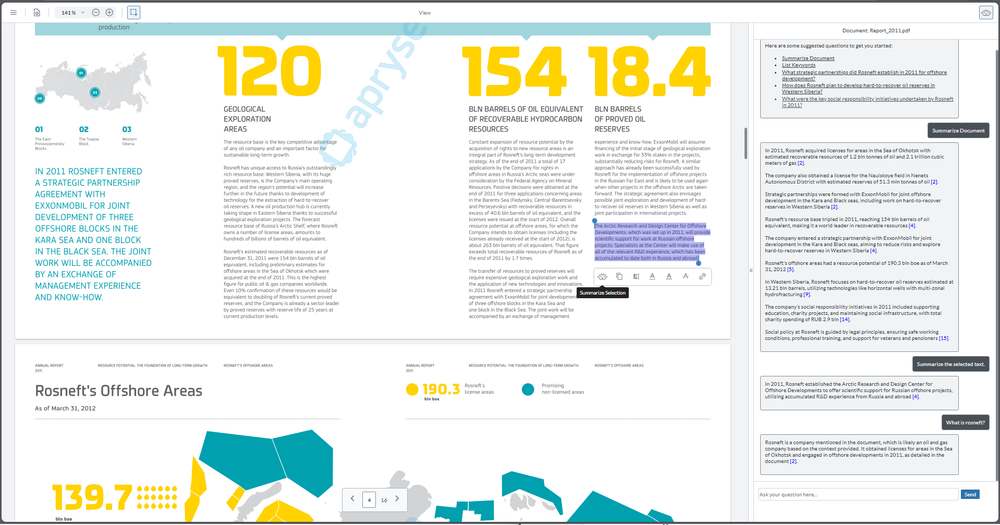

# WebViewer - Ask AI sample

Add an AI-powered assistant to WebViewer, enabling chat-based Q&A, document and selected-text summarization, keyword extraction, and contextual prompts that lets users ask questions about their PDFs. 


[WebViewer](https://apryse.com/products/webviewer) is a powerful JavaScript-based PDF Library that is part of the [Apryse SDK](https://apryse.com/).

- [WebViewer Documentation](https://docs.apryse.com/web/guides/get-started)
- [WebViewer Demo](https://showcase.apryse.com/)

    


## Getting started

A license key is required to run WebViewer. You can obtain a trial key in our [get started guides](https://docs.apryse.com/web/guides/get-started), or by signing-up on our [developer portal](https://dev.apryse.com/).

## Initial setup

Before you begin, make sure the development environment includes [Node.js](https://nodejs.org/en/).

## Install

```
git clone --depth=1 https://github.com/ApryseSDK/webviewer-samples.git
cd webviewer-samples/webviewer-ask-ai
npm install
```

## Configuration

OpenAI is the default backend for this sample. To get started, rename `.env.example` file into `.env` and fill the following: 

```
OPENAI_API_KEY=your-openai-api-key-here
OPENAI_MODEL=your-openai-model-here
OPENAI_MAX_TOKENS=your-openai-max-tokens-here
OPENAI_TEMPERATURE=your-openai-temperature-here
OPENAI_SEED=your-openai-seed-here
```

To use another model, replace the LangChain provider in `server/llmManager.js`, install the corresponding provider package, and update the `.env` variables for that model provider. 

## Run

```
npm start
```

This will start a server that you can access the WebViewer client at http://localhost:4040/client/index.html, and manage the connection to the OpenAI on backend.