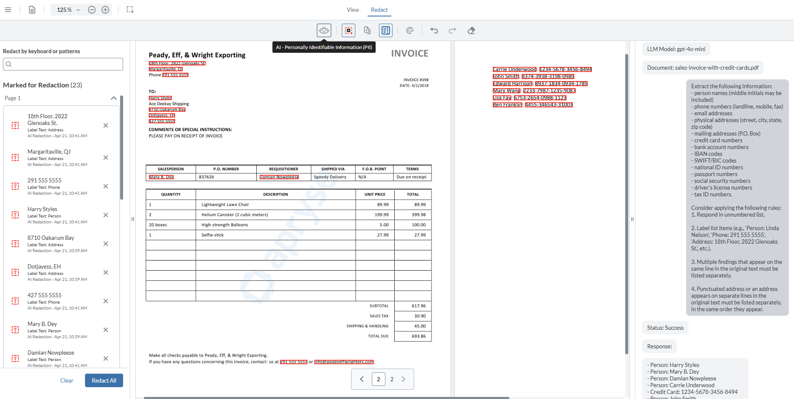

# WebViewer - Redaction AI sample

Add an AI-powered assistant to WebViewer, detect Personally Identifiable Information (PII) in the provided PDF, and apply redaction to the identified information.

[WebViewer](https://apryse.com/products/webviewer) is a powerful JavaScript-based PDF Library that is part of the [Apryse SDK](https://apryse.com/).

- [WebViewer Documentation](https://docs.apryse.com/web/guides/get-started)
- [WebViewer Demo](https://showcase.apryse.com/)



## Get Started

A license key is required to run WebViewer. You can obtain a trial key in our [get started guides](https://docs.apryse.com/web/guides/get-started), or by signing-up on our [developer portal](https://dev.apryse.com/).

## Initial Setup

Before you begin, make sure the development environment includes [Node.js](https://nodejs.org/en/).

## Install

```
git clone --depth=1 https://github.com/ApryseSDK/webviewer-samples.git
cd webviewer-samples/webviewer-redaction-ai
npm install
```

## Configuration

This sample utilizes AI through LangChain framework. It integrates OpenAI (as the default chat model) to operate in the backend server.

To get started, rename `.env.example` file into `.env` and fill the following credentials:

```
OPENAI_API_KEY=your-openai-api-key-here
OPENAI_MODEL=your-openai-model-here
OPENAI_MAX_TOKENS=your-openai-max-tokens-here
OPENAI_TEMPERATURE=your-openai-temperature-here
```

These credentials will be used to configure the chat model behavior via parameters set, for example:

**Chat model configuration**:

- `apiKey` - Authenticates the model's provider.
- `model` - Specifies the model to use with a provider.

**Response configuration**:

- `maxTokens` - Controls the tokens total number. It is useful in controlling latency and cost as it maintains the balance, but consider set it too low can truncate outputs; set it too high and can increase cost and response time.
- `temperature` - Controls randomness. Higher value generates creative response, while lower value generates deterministic and consistent ones. It is useful for extraction, redaction decisions, classification, and structured output.

For this sample these credential parameters are used in the [LLM initialization](https://github.com/ApryseSDK/webviewer-samples/blob/main/webviewer-redaction-ai/server/llmManager.js#L21), and their values are read from the matching configurations within the `.env` file.

For more information and usage of the credential parameters, refer to [Parameters](https://docs.langchain.com/oss/javascript/langchain/models#parameters).

### Recommended Values

For stable sample performance, the following configuration is recommended:

- `OPENAI_MAX_TOKENS=500`
- `OPENAI_TEMPERATURE=0.0`

## Run

```
npm start
```

## Chat Model Swapping

LangChain framework supports integration to variety of chat model providers, for example Anthropic, Google Gemini, etc. For the complete list, refer to All chat models in [Chat model integrations](https://docs.langchain.com/oss/javascript/integrations/chat).

To swap to another chat model:

1. Replace `@langchain/openai` in [package.json](https://github.com/ApryseSDK/webviewer-samples/blob/main/webviewer-redaction-ai/package.json#L23) by the appropriate chat model package. For example:

   - **Anthropic**: `@langchain/anthropic`
   - **Google Gemini**: `@langchain/google`

2. Replace the credentials in the `.env` by the appropriate ones of the chat model intend to use. For example:

   - **Anthropic**: `ANTHROPIC_API_KEY=your-api-key`, `ANTHROPIC_MODEL=your-model-here`, etc.
   - **Google Gemini**: `GOOGLE_API_KEY=your-api-key`, `GOOGLE_MODEL=your-model-here`, etc.

3. Replace `ChatOpenAI` wrapper class in `server/llmManager.js` file by the appropriate class of the chat model intend to use. For example:

   - **Anthropic**: `ChatAnthropic`
   - **Google Gemini**: `ChatGoogle`

   This will take place in two lines:

   - [import statement](https://github.com/ApryseSDK/webviewer-samples/blob/main/webviewer-redaction-ai/server/llmManager.js#L1).
   - [LLM initialization](https://github.com/ApryseSDK/webviewer-samples/blob/main/webviewer-redaction-ai/server/llmManager.js#L21).

## Architecture

The sample application follows a client–server architecture. It starts a backend server that hosts and manages the OpenAI chat model integration, while exposing a WebViewer client accessible at http://localhost:4040/client/index.html.

This architecture enables the application to enforce security best practices by handling sensitive operations—such as API key management and OpenAI interactions—exclusively on the server side. As a result, confidential credentials are never exposed to the client, significantly reducing security risks and ensuring proper access control.
